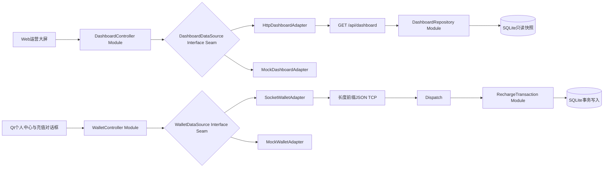

# ChargeHub Web大屏与Qt钱包优化规格

## 1. 文档信息

- 项目：东软电动汽车充电桩应用管理平台（ChargeHub）
- 组别：第9组
- 优化范围：Web运营大屏、Qt用户端余额与模拟充值，以及完成这两部分所必需的协议和数据库改动
- 基线版本：当前 `ChargeHub/` 原型导入提交
- 目标环境：Ubuntu 22.04/24.04、Qt5 qmake、SQLite、Python 3 + Flask、本地ECharts
- 最终截止时间：2026年9月10日
- 状态：可进入分阶段开发

本文只描述当前负责人需要完成和推动联调的优化，不重写无关模块。登录、找桩、充电、管理端、机器学习训练等现有能力只有在影响余额或大屏数据契约时才进入修改范围。

## 2. 需求依据与冲突处理

实现时按以下优先级判断：

1. 老师项目说明书中的明确基础要求；
2. 本文已经确认的Web大屏和钱包验收标准；
3. 小组当前原型的可运行行为与协议；
4. README、截图、群聊等补充资料。

如果现有实现与老师要求冲突，不把“已经写了”视为正确。需要跨成员修改数据库、协议或登录流程时，先记录决定并同步小组，不在界面代码中私自兼容多个相互矛盾的口径。

## 3. 现有原型基线

### 3.1 已经具备的能力

| 区域 | 当前实现 | 可复用部分 |
| --- | --- | --- |
| Qt用户端 | Qt Widgets，`Client` 通过长度前缀JSON连接TCP 8888 | 登录后的用户对象、个人中心、余额标签、充值输入和充值记录页面 |
| 管理/服务器端 | `Dispatch` 处理业务，`Database` 写SQLite | 会话校验、用户状态校验、统一响应包、WAL数据库 |
| Web大屏 | Flask读取SQLite，静态HTML加载本地ECharts，每5秒刷新 | `/api/overview`、`/api/analysis`、六个图表容器、本地资源和响应式基础布局 |
| 分析 | Python脚本写预测及分析表 | `load_forecast`、`hourly_load`、`analysis_report`等只读展示数据 |
| 部署 | qmake脚本、Linux打包脚本、单机和联调说明 | Ubuntu运行目录、端口约定、值班服务器方式 |

### 3.2 必须优化的问题

#### Web运营大屏

- 浏览器需要同时请求两个端点，任一失败会使整次刷新直接返回，预测故障会连带影响运营数据；
- 请求失败被静默吞掉，没有错误提示、最后成功时间和手动刷新；
- `setInterval` 没有进行中保护，慢请求可能重叠；
- 数据库异常在Flask中被统一变成空数组，无法区分“确实为空”和“查询失败”；
- `/api/overview` 返回服务器数据库绝对路径，不应暴露；
- 页面通过 `innerHTML` 拼接数据库文本，站名或告警内容可能形成脚本注入；
- 只有近7日图表，缺少近7日/30日切换；
- 24小时图当前展示订单数，不是说明书要求的充电量；
- 站点排行缺少营收、订单数和利用率的统一排序；
- 预测没有清楚的1小时、6小时、24小时切换和不可用状态；
- HTML、CSS和JavaScript混在一个文件中，缺少可独立测试的数据模型。

#### Qt用户端余额与模拟充值

- 金额使用 `double` 和SQLite `REAL`，可能产生货币精度误差；
- 客户端只校验大于0和不超过10000，没有严格限制两位小数；
- 确认按钮提交后没有禁用，连续点击会产生多笔充值；
- 请求没有 `requestId`，断线重试或重复到达无法保证幂等；
- 更新余额和写充值流水是两条独立SQL，不在同一事务，失败时可能只完成一半；
- 数据库执行结果没有明确成功/失败返回，存储失败可能仍返回“充值成功”；
- 超时后没有 `uncertain` 状态和结果查询流程；
- 进入个人中心虽会查询充值记录，但没有使用响应中的余额刷新顶部余额；
- 缺少钱包领域自动化测试和Socket幂等集成测试。

## 4. 优化目标与成功标准

### 4.1 Web目标

- 运营人员在一个屏幕内读懂营收、充电量、设备状态、站点排行和负荷预测；
- 页面每5秒刷新且可手动刷新，同一时刻最多一个刷新请求；
- 刷新失败保留最近一次成功快照，并显示错误与最后成功时间；
- 预测缺失只降级预测区域，其他指标和图表继续工作；
- 真实SQLite数据与固定演示数据使用同一个版本化契约；
- 所有ECharts资源本地加载，离线演示不依赖公共CDN。

### 4.2 钱包目标

- 用户进入个人中心能看到服务器权威余额，未知余额不得伪装成0；
- 金额只以整数分传输、计算和持久化，展示时格式化为元；
- 0.01元和10000.00元允许提交，空值、非数字、0、负数、10000.01和三位小数必须拦截；
- 一次点击只生成一个 `requestId`，同一个 `requestId` 无论到达多少次只入账一次；
- 余额增加与充值流水写入同一事务，任一步失败都回滚；
- 网络超时进入 `uncertain`，先查询原请求结果，不自动生成新充值；
- 成功后立即使用服务器返回的 `balanceCents` 更新界面。

### 4.3 共同成功标准

- 所有新增代码符合大驼峰类名、小驼峰函数/变量、全小写无下划线文件名的规则；
- 自动化测试、Ubuntu 24.04构建、浏览器冒烟和Qt界面验收通过；
- 每个Phase使用独立Git commit，提交前没有混入无关修改或敏感信息。

## 5. 范围

### 5.1 P0必须完成

#### Web运营大屏

- 总充电量、总充电费用、活跃电桩三个核心指标；
- 近7日/30日营收趋势切换；
- 空闲、在用、故障数量及占比；
- 北京时间0至23时的24小时充电量；
- 按已支付营收降序的站点排行，展示营收、订单数、设备利用率；
- 1小时、6小时、24小时负荷预测切换；
- 自动/手动刷新、请求防重叠、最后成功快照和错误状态；
- 加载、空数据、字段异常、核心查询失败和预测不可用状态；
- 固定演示JSON与本地ECharts离线运行。

#### Qt用户端余额与模拟充值

- 权威余额查询与格式化展示；
- 充值输入、快捷金额、二次确认和严格金额校验；
- 提交中状态和重复点击保护；
- 整数分、唯一请求编号、事务和幂等处理；
- 成功、业务失败、存储失败、断线和超时不确定状态；
- 充值记录展示和余额同步刷新。

### 5.2 P1在P0完成后再做

- 大屏站点地图、告警滚动区、模型MAE/RMSE和主题动效；
- 钱包流水筛选、分页、导出和更丰富的支付动画；
- Web访问鉴权、HTTPS反向代理和跨机器部署增强；
- 将旧的元金额字段完全移除。

### 5.3 明确不在当前负责人范围

- 真实支付、短信、银行卡或第三方支付SDK；
- 训练或改造机器学习模型；
- 重写找桩、预约、充电、结算和管理后台；
- 将SQLite替换为MySQL、InfluxDB或其他数据库；
- 为了展示效果生成随机预测并冒充真实结果；
- 在P0阶段整体迁移到前端框架或重新设计全部Qt界面。

## 6. 技术决策与架构

### 6.1 P0技术选型

- 保留当前Qt5 + qmake，避免在截止日前同时迁移框架和修改业务；
- 保留TCP长度前缀JSON协议和8888端口；
- 保留SQLite WAL，管理端仍是业务数据唯一写入进程；
- 保留Python Flask和本地ECharts，不引入Vue、React、Vite或公共CDN；
- 浏览器只访问HTTP，不直接打开SQLite；
- Flask以只读连接生成规范化快照，不返回数据库路径或敏感字段。

### 6.2 优化后数据流



### 6.3 Module与Interface

`DashboardController` Module只暴露以下行为：

- `start()`：立即加载并启动唯一的5秒定时器；
- `refresh()`：在没有进行中请求时获取新快照；
- `stop()`：清理定时器、监听器和未完成请求；
- `getState()`：返回 `loading/ready/stale/error`、当前快照和最后成功时间。

图表只消费规范化快照，不知道数据来自HTTP还是固定JSON。

`DashboardRepository` Module在一次只读连接中完成聚合、补零、排序和预测降级。核心查询失败时整个端点返回错误；仅分析表缺失时返回 `loadForecast.status=unavailable`。

`WalletController` Module只暴露：

- `loadWallet()`：查询权威余额和充值记录；
- `parseAmountCents(text)`：把合法字符串转换为1至1000000之间的整数分；
- `submitRecharge(amountText)`：一次操作生成一次请求编号并提交；
- `queryPendingRequest()`：超时后查询原请求结果。

Qt视图不直接拼Socket JSON，不计算新余额，也不访问SQLite。

`RechargeTransaction` Module以小Interface隐藏事务、幂等和并发：

```cpp
RechargeResult applyRecharge(
    int userId,
    qint64 amountCents,
    const QString &requestId
);
```

## 7. Web详细需求

### WEB-001 统一快照端点

- 新增 `GET /api/dashboard`，浏览器一次请求获取完整大屏快照；
- 旧 `/api/overview` 和 `/api/analysis` 可在过渡期保留，但新页面不再依赖它们；
- 响应头使用 `Cache-Control: no-store`；
- 核心数据库不可读时返回HTTP 503和不含路径、SQL、令牌的错误信息；
- 预测表不存在或没有记录时仍返回HTTP 200，只将预测状态设为不可用。

### WEB-002 指标与数据口径

- 总充电量：状态为“已完成”的订单 `energy_kwh` 之和；
- 总充电费用：状态为“已完成”的订单实付金额之和；
- 活跃电桩：状态为“闲置”或“在用”的电桩数量；
- 营收均使用整数分，页面显示时再转成两位小数元；
- 近7日/30日包含当天，按 `Asia/Shanghai` 自然日升序，缺失日期补0；
- 24小时充电量按当天开始时间归入0至23时，缺失小时补0；
- 状态总数为0时占比统一为0%，不得除零；
- 站点排行按营收降序，同值按 `stationId` 升序保证稳定；
- 重复、负值、非法时间和未知状态不能当作正常数据展示。

### WEB-003 图表与交互

- 顶部展示三个核心指标、数据来源、数据时间、最后成功时间和刷新按钮；
- 营收趋势提供“近7日/近30日”按钮；
- 电桩状态使用环图并同时显示文字数量和占比，不能只靠颜色；
- 24小时充电量展示0至23时及kWh单位；
- 站点排行至少展示站名、营收、订单数、利用率；
- 预测提供“1小时/6小时/24小时”按钮，并显示负荷、预计空闲桩和高峰标记；
- 图例、坐标轴、单位和tooltip必须清楚；
- 浏览器窗口变化时统一调用所有图表的 `resize()`。

### WEB-004 刷新与异常恢复

- 页面加载后立即获取一次；
- 默认每5秒触发刷新，也允许手动刷新；
- 同一时刻最多一个刷新请求，手动点击不得制造并发请求；
- 每次成功后原子替换整个可信快照；
- 请求失败保留最近一次成功快照，状态改为 `stale` 并显示原因；
- 首次加载失败时展示可重试空状态，不留下全0假数据；
- 页面隐藏或销毁时停止定时器并中止旧请求；
- 预测不可用时显示“预测数据暂不可用”，不得清空其他图表。

### WEB-005 安全与隐私

- 不向浏览器返回数据库绝对路径、密码哈希、令牌、完整手机号或头像数据；
- 所有来自数据库的文本通过 `textContent` 或安全DOM节点渲染；
- 禁止把站名、告警详情等直接拼入 `innerHTML`；
- SQL值全部参数化；动态日期条件只能来自内部白名单；
- 服务器日志记录错误类别，不打印密码、token或完整手机号。

### WEB-006 页面拆分

将当前单文件页面逐步拆为：

```text
dashboard/
  app.py
  index.html
  dashboard.css
  dashboard.js
  dashboarddata.js
  dashboardmodel.js
  echarts.min.js
  data/dashboard.json
```

文件名必须全小写且不含下划线。拆分后不增加构建步骤，Flask仍直接提供静态文件。

## 8. Web数据契约

`GET /api/dashboard` 的基线结构：

```json
{
  "schemaVersion": "1.0",
  "generatedAt": "2026-09-02T20:00:00+08:00",
  "timeZone": "Asia/Shanghai",
  "source": "live",
  "metrics": {
    "totalChargeKwh": 87342.0,
    "totalRevenueCents": 10306400,
    "activePileCount": 11
  },
  "revenueTrend": {
    "rangeDays": 30,
    "points": [
      {"date": "2026-09-02", "revenueCents": 126800}
    ]
  },
  "pileStatus": {
    "idle": 8,
    "inUse": 3,
    "fault": 1
  },
  "hourlyCharge": [
    {"hour": 0, "chargeKwh": 85.5}
  ],
  "stationRanking": [
    {
      "stationId": 1,
      "stationName": "北京理工大学充电站",
      "revenueCents": 356800,
      "orderCount": 128,
      "utilizationPercent": 78.6
    }
  ],
  "loadForecast": {
    "status": "available",
    "modelVersion": "baseline-1",
    "series": [
      {
        "horizonHours": 1,
        "points": [
          {
            "time": "2026-09-02T21:00:00+08:00",
            "loadKw": 420.0,
            "availablePileCount": 4,
            "isPeak": false
          }
        ]
      }
    ]
  }
}
```

契约不变量：

- `schemaVersion` 不兼容时拒绝替换可信快照；
- `generatedAt` 必须为带时区的ISO 8601时间；
- `source` 只能是 `live` 或 `mock`，`mock` 必须显示“演示数据”；
- 所有金额字段为非负整数分；
- 规范化后营收趋势有30项，页面从中截取最后7项；
- 规范化后小时数据有0至23共24项；
- `loadForecast.status` 只能为 `available` 或 `unavailable`；
- 缺失字段显示 `--` 或明确空状态，合法的0必须保留为0。

## 9. Qt钱包详细需求

### WAL-001 权威余额

- 登录成功、进入个人中心和充值成功后调用 `loadWallet()`；
- 加载中显示“余额加载中”，失败显示“余额暂不可用”；
- 服务器返回多少 `balanceCents` 就显示多少，不用客户端旧余额累加；
- 显示格式固定为 `¥0.00`。

### WAL-002 金额输入

- 输入必须匹配十进制元金额，最多两位小数；
- 合法范围是0.01至10000.00元，即1至1000000分；
- 不能用 `QString::toDouble()` 作为最终金额转换；
- 使用纯函数 `parseAmountCents` 按字符串拆分元和角分；
- 快捷金额只负责填入输入框，仍走同一校验；
- 提交前二次显示格式化金额并要求用户确认。

### WAL-003 提交状态

钱包交互状态：

```text
idle → loading → ready → editing → confirming → submitting → succeeded
                                                        ↘ failed
                                                        ↘ uncertain → querying → succeeded/failed
```

- `submitting` 和 `querying` 时禁用确认按钮及快捷金额按钮；
- 一次用户操作只创建一个 `requestId`；
- 快速连点、回车重复触发和重复响应都不得产生第二笔请求；
- 成功或明确失败后恢复按钮；
- 超时只进入 `uncertain`，不得自动使用新请求编号再次充值。

### WAL-004 服务端事务与幂等

- 服务端重新校验用户存在、状态正常、金额范围和请求编号；
- `RechargeTransaction` 使用 `BEGIN IMMEDIATE` 开始事务；
- 先按 `requestId` 查询历史记录；已存在则返回原结果；
- 新请求在同一事务中写充值流水并增加用户余额；
- 任一步失败执行 `ROLLBACK`，余额和流水均保持原状；
- 成功执行 `COMMIT`，返回服务器计算的 `balanceCents`；
- 并发的相同 `requestId` 由数据库唯一索引兜底，只能有一条成功流水。

### WAL-005 超时与查询

- 新增按 `requestId` 查询充值结果的能力；
- 客户端超时后保留原请求编号并请求状态；
- 已成功返回原 `tradeNo`、`amountCents` 和 `balanceCents`；
- 明确不存在时提示用户选择“重新查询”或“新建一笔充值”；
- 新建一笔必须由用户主动触发并生成新的请求编号。

### WAL-006 错误

至少统一处理：

| errorCode | 含义 | 界面行为 |
| --- | --- | --- |
| `INVALID_AMOUNT` | 金额格式或范围错误 | 保留输入，定位到金额框 |
| `INVALID_REQUEST_ID` | 请求编号为空或非法 | 恢复按钮并记录客户端错误 |
| `USER_NOT_FOUND` | 用户不存在 | 提示重新登录 |
| `USER_FROZEN` | 账号冻结 | 禁止继续充值 |
| `NETWORK_ERROR` | 无法连接 | 保留当前可信余额 |
| `TIMEOUT` | 结果不确定 | 进入 `uncertain` 并允许查询 |
| `STORAGE_ERROR` | 事务失败 | 余额不变，允许稍后重试 |
| `PROTOCOL_ERROR` | 响应缺字段或版本错误 | 拒绝更新余额 |

## 10. 钱包协议与数据库迁移

### 10.1 Socket请求

继续使用现有 `RECHARGE` 类型，P0请求改为：

```json
{
  "type": "RECHARGE",
  "seq": 21,
  "role": "user",
  "token": "session-token",
  "data": {
    "amountCents": 2000,
    "requestId": "9dc97269-7758-4de6-9e6d-e2c682913a74"
  }
}
```

成功响应：

```json
{
  "type": "RECHARGE",
  "seq": 21,
  "code": 0,
  "message": "充值成功",
  "data": {
    "requestId": "9dc97269-7758-4de6-9e6d-e2c682913a74",
    "tradeNo": "RC00000042",
    "amountCents": 2000,
    "balanceCents": 10000,
    "status": "succeeded"
  }
}
```

新增 `QUERY_RECHARGE`，请求只带 `requestId`。`QUERY_WALLET` 返回 `balanceCents` 和最近30条充值记录。旧 `LIST_RECHARGE` 可在迁移期作为别名，所有客户端升级后再移除。

错误响应在现有数字 `code` 外增加稳定字符串 `errorCode`，界面逻辑不得依赖中文文案。

### 10.2 加法式数据库迁移

不删除现有数据，先增加：

- `user.balance_cents INTEGER NOT NULL DEFAULT 0`；
- `recharge_log.amount_cents INTEGER NOT NULL DEFAULT 0`；
- `recharge_log.balance_after_cents INTEGER NOT NULL DEFAULT 0`；
- `recharge_log.request_id TEXT`；
- `recharge_log.trade_no TEXT`；
- `recharge_log.status TEXT NOT NULL DEFAULT 'succeeded'`；
- `request_id` 和 `trade_no` 的唯一索引。

迁移旧数据时使用 `ROUND(balance * 100)` 和 `ROUND(amount * 100)`，旧流水生成 `legacy-<id>` 请求编号。迁移脚本必须可重复执行；`database/schema.sql`、C++内置建表字符串和测试夹具必须同步。

过渡期读取优先使用整数分列；旧 `REAL` 列仅用于兼容，不再作为新充值的权威值。完全删除旧列属于P1，需要全组确认和备份。

## 11. 非功能需求

### 11.1 性能

- 1920×1080本地首屏目标小于2秒；
- `/api/dashboard` 本地响应目标小于1秒；
- 一次快照使用一个只读连接，避免按站点重复创建连接的N+1查询；
- 页面连续运行30分钟无重复定时器、请求堆积或明显卡顿；
- 充值事务目标小于1秒，数据库忙时最多等待5秒并返回明确失败。

### 11.2 可靠性

- Flask连接使用SQLite只读模式、`query_only` 和 `busy_timeout`；
- 预测区域与核心业务区域独立降级；
- 钱包只接受服务器权威余额；
- 所有Schema迁移在备份副本上先验证；
- 日志记录错误码和关联请求编号，不记录token或完整手机号。

### 11.3 安全

- Web保持只读，不提供修改订单、用户、桩状态或余额的HTTP路由；
- 页面禁止不可信HTML注入；
- TCP帧继续限制最大8MiB，钱包请求另限制为小型JSON；
- `requestId` 只用于幂等，不包含手机号等个人信息；
- Git中不得提交真实数据库、服务器IP、地图密钥、密码或token。

### 11.4 兼容与成本

- P0优先复用现有Qt5、Flask和ECharts代码；
- 不新增数据库服务器、前端构建链和云服务；
- Ubuntu 22.04与24.04使用相同源码；
- Qt版本只允许全组统一一种，不维护Qt5/Qt6两套发布包。

## 12. 测试策略

### 12.1 Web自动化测试

使用Python `unittest` + Flask测试客户端和临时SQLite：

- 合法完整快照；
- 7/30日补0和日期升序；
- 24小时补0、负值和非法时间；
- 电桩总数为0时占比为0；
- 站点营收排序与稳定同值顺序；
- 核心库不可读返回503且不泄漏路径；
- 分析表缺失只使预测不可用；
- 响应不包含手机号、密码、token和数据库路径。

使用Node内置测试运行拆分后的纯JavaScript Module：

- 金额、单位和缺失值格式化；
- 近7日/30日和预测1/6/24小时选择；
- 同一时刻只有一个刷新Promise；
- 失败保留最近一次成功快照；
- `start/stop` 不产生重复定时器；
- 不兼容 `schemaVersion` 拒绝替换。

### 12.2 Qt钱包自动化测试

使用Qt Test：

- `0.01` 和 `10000.00` 转换成功；
- 空值、文字、`0`、负数、`10000.01`、`1.001`失败；
- 成功后使用响应中的 `balanceCents`，不在客户端累加；
- 快速重复点击只发送一次；
- 超时进入 `uncertain`，不自动再次充值；
- 协议缺少 `requestId` 或 `balanceCents` 时拒绝更新。

### 12.3 数据库与Socket集成测试

- 相同 `requestId` 连续发送两次，只产生一条流水且余额只增加一次；
- 两个连接并发发送相同 `requestId`，结果一致；
- 模拟流水写入失败，余额不变化；
- 冻结、注销和不存在的用户不能充值；
- `QUERY_RECHARGE` 能查询成功和不存在状态；
- 迁移前旧余额与迁移后 `balanceCents` 完全一致。

### 12.4 人工与Ubuntu验收

- Ubuntu 24.04重新编译管理端和用户端；
- 浏览器检查1920×1080、1366×768和窄窗口；
- 断开Flask、暂时移除预测数据、制造SQLite忙三种降级演练；
- 单机完成登录→查询余额→充值→刷新余额→查看流水；
- 连续运行30分钟，检查浏览器控制台、Qt日志和进程资源；
- 使用固定演示JSON完成离线演示。

## 13. 分阶段实施计划

| 阶段 | 目标 | 主要交付 | 完成条件 | 建议日期 |
| --- | --- | --- | --- | --- |
| Phase 0 | 原型与规格基线 | 导入原型、现状审计、本规格 | 文档测试通过并独立提交 | 9月2日 |
| Phase 1 | 测试与兼容骨架 | Web测试目录、Qt Test目标、临时数据库夹具、长度前缀与JSON包络版本兼容 | 测试能先失败再驱动实现；充值业务字段兼容留在Phase 4 | 9月3日 |
| Phase 2 | Web快照后端 | `GET /api/dashboard`、统一口径、只读连接、预测降级 | Web后端P0测试全部通过 | 9月4日 |
| Phase 3 | Web页面优化 | 文件拆分、核心指标、全部P0图表、切换与刷新状态 | AC-WEB-01至10通过 | 9月5日 |
| Phase 4 | 钱包服务端正确性 | 整数分迁移、协议、事务、幂等与结果查询 | 数据库和Socket测试通过 | 9月6日 |
| Phase 5 | 钱包Qt交互 | 金额解析、二次确认、提交状态、超时查询和余额刷新 | AC-WAL-01至06通过 | 9月7日 |
| Phase 6 | 联调与交付 | Ubuntu构建、端到端回归、30分钟稳定性、README与演示材料 | 全部验收项关闭并提交 | 9月8日至9日 |

每个Phase独立提交。上一Phase的公共Interface未通过测试时，不并行铺开下一阶段页面或协议调用。

## 14. 验收矩阵

| 编号 | 场景 | 通过标准 |
| --- | --- | --- |
| AC-WEB-01 | 首次打开 | 2秒目标内出现布局和明确加载状态，不白屏 |
| AC-WEB-02 | 核心指标 | 总电量、总费用、活跃桩与SQLite约定数据一致，0不显示为缺失 |
| AC-WEB-03 | 趋势切换 | 近7日/30日点数、顺序和补0正确 |
| AC-WEB-04 | 电桩状态 | 三种状态数量和占比正确，总数0安全 |
| AC-WEB-05 | 24小时电量 | 0至23时完整，单位为kWh，缺失补0 |
| AC-WEB-06 | 站点排行 | 营收降序，站名、营收、订单、利用率完整，同值稳定 |
| AC-WEB-07 | 负荷预测 | 1小时、6小时、24小时可切换；不可用时仅该区域降级 |
| AC-WEB-08 | 刷新控制 | 每5秒刷新、手动刷新有效、无重叠请求或重复定时器 |
| AC-WEB-09 | 失败恢复 | 保留最近一次成功快照并显示错误和最后成功时间 |
| AC-WEB-10 | 离线与安全 | 本地ECharts和固定JSON可演示，页面无不可信HTML和敏感字段 |
| AC-WAL-01 | 查询余额 | 服务器返回多少分即显示多少，失败不显示假0 |
| AC-WAL-02 | 金额边界 | 0.01和10000.00通过，其余约定非法输入被拦截 |
| AC-WAL-03 | 充值成功 | 流水和余额在同一事务提交，界面使用 `balanceCents` 立即刷新 |
| AC-WAL-04 | 重复提交 | 一次操作只发送一次，相同 `requestId` 只入账一次 |
| AC-WAL-05 | 不确定结果 | 超时进入 `uncertain` 并查询原请求，不自动新建充值 |
| AC-WAL-06 | 服务失败 | 存储、冻结、协议和网络失败时余额不变且提示可理解 |
| AC-ALL-01 | 交付质量 | 命名、测试、Ubuntu验证、Git diff、提交和隐私检查全部通过 |

## 15. 需要小组协商的决定

以下事项不阻塞Phase 1至3，但Phase 4前必须确认：

1. **Qt5还是Qt6**：当前源码、脚本和打包目录都按Qt5设计；推荐本次截止前继续Qt5，全组不要各自选择版本。
2. **充值协议与数据库迁移**：需要管理/服务器与数据库负责人同意 `amountCents`、`balanceCents`、`requestId`、唯一索引和事务Interface。
3. **手机号免密登录**：老师原始要求与当前“密码注册/登录”实现存在冲突，应由组长向老师确认；这不应由Web/钱包负责人单独决定。
4. **预测输出口径**：分析负责人需确认预测单位是kW还是kWh、每个时间窗口返回总量还是逐小时序列，以及首份稳定数据时间。
5. **站点利用率口径**：推荐使用统计周期内“实际充电时长 ÷ 可提供充电总时长”，需与管理端图表保持一致。

确认结果必须同步修改 `protocol/messages.md`、`database/schema.sql`、README、测试和本规格，并创建独立Git commit。

## 16. TODO

- [x] 导入并阅读ChargeHub原型；
- [x] 识别Web大屏和钱包的现状、缺口、风险与复用点；
- [x] 定义P0/P1、Module、Interface、数据契约和验收矩阵；
- [ ] 与小组确认Qt版本、登录冲突、充值迁移和预测口径；
- [x] Phase 1：建立优化测试与兼容骨架；
- [x] Phase 2：实现统一Web快照端点；
- [x] Phase 3：完成Web页面和可靠刷新；
- [x] Phase 4：完成钱包事务、幂等和查询协议；
- [x] Phase 5：完成Qt钱包交互状态与自动化测试；
- [x] Phase 6：完成Ubuntu联调、稳定性和交付文档；
- [x] 每次改动后运行相关测试、检查Git diff并创建对应commit。
